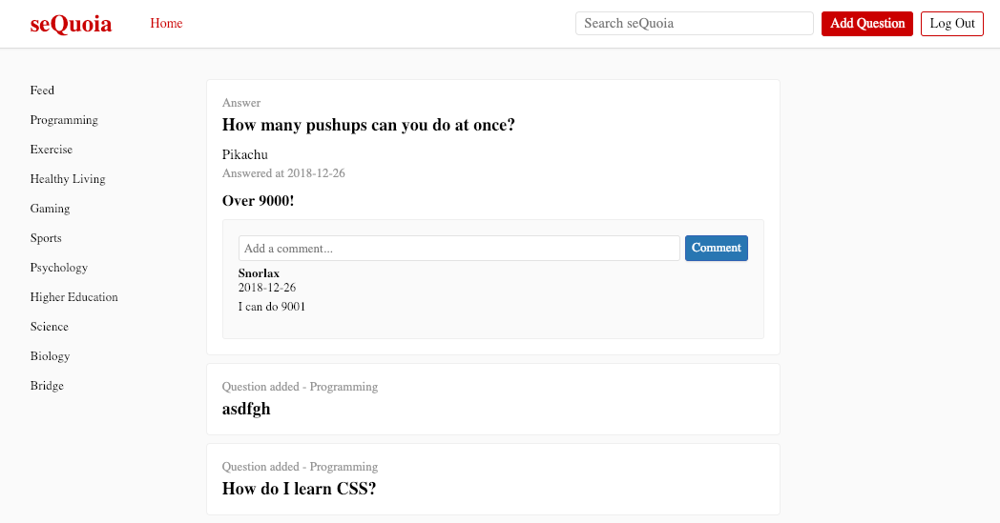
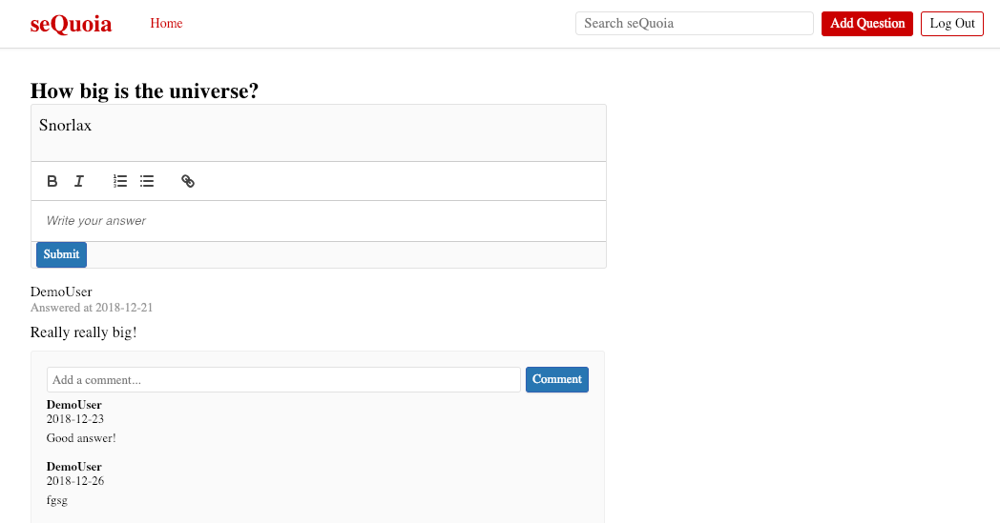
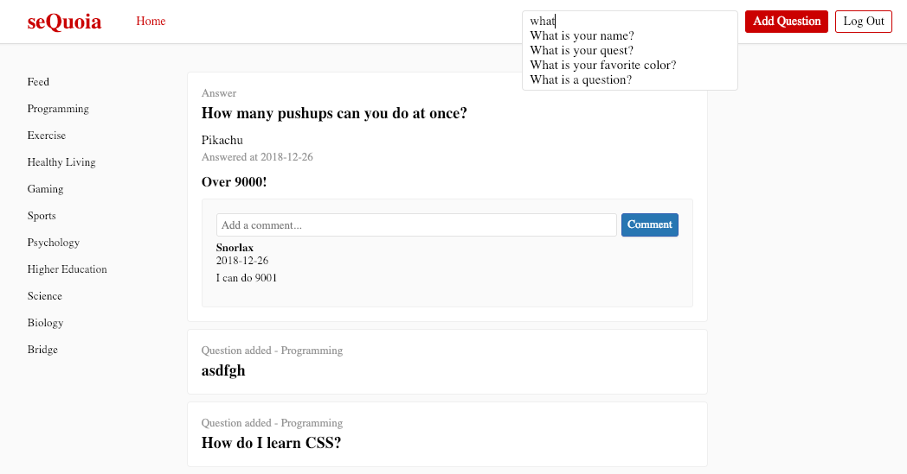

# seQuoia

[Live link](https://sequoiaapp.herokuapp.com/)

seQuoia is a Quora-inspired web app that allows users to ask and receive answers to questions. Questions each belong to a topic and can be filtered by topic on the main page.

# Technologies

* Ruby
* Rails
* Javascript
* React/Redux
* HTML

# Feature Highlights

* Main Feed



The main feed contains a randomized list of questions and answers on the website. Users may click on the sidebar in order to filter the feed to only show questions and answers belonging to that topic.

* Question Show Page



Each question has its own page where users can respond with answers. The page lists all answers to the question and their comments.

* Responsive Search



The search feature updates results on each key press and displays them in a list. Users may then click a question to view that question's show page.

The Search component works by calling a handleSearch function after each key press. This function filters question titles according to the current search query. The component state is then updated with the current value of the search query.

```  
handleSearch(e) {
  if (e.target.value === "") {
    this.resetSearch(e);
  } else {
    this.props.fetchQuestions()
    const filteredQuestions = this.props.questions.filter(
      (question) => question.title.toLowerCase().includes(e.target.value.toLowerCase())
    )
    this.setState({
      query: e.target.value,
      questions: filteredQuestions
    })
  }
}
```

# Future Directions
* Add ability to comment on other comments
* Create user profiles showing the questions and answers they have written
* Allow users to subscribe to topics
